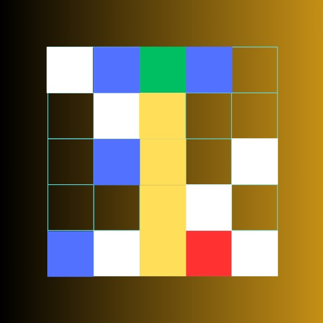

# About the Project
This site employs the usage of an A* search algorithm for efficient pathfinding (encompassing a heuristic manhattan distance and a path cost) as per the the start cell, goal cell and obstructions. The grid of cells exhibits the color changing behaviour via JavaScript and Jinja and Flask are used to dynamically render the content onto the webpage. The search algorithm is implemented in a seperate Python script.

## Website Link

## Demo

## Recognition:

### Submitted to Coolest Projects Online 2025 (Advanced Programming)

#### Feedback:
